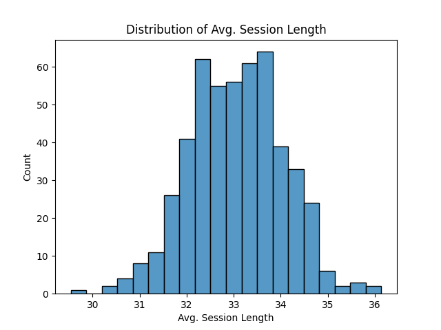
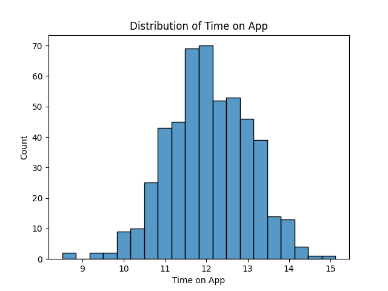
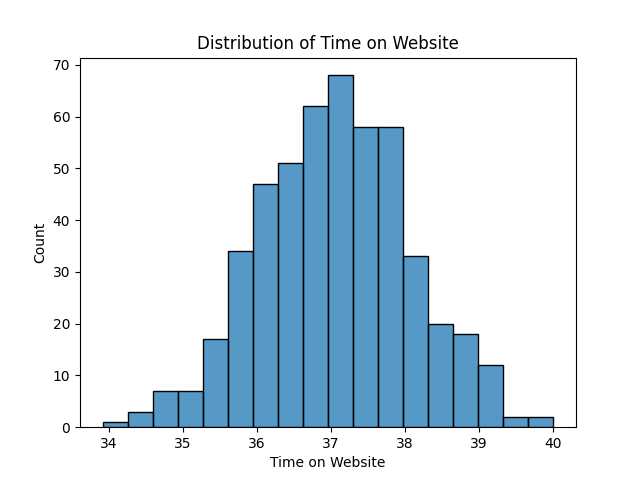
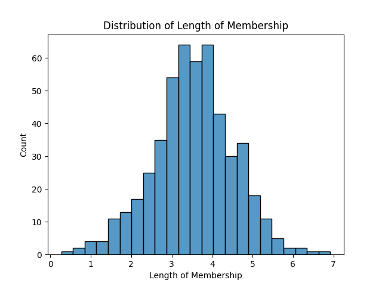
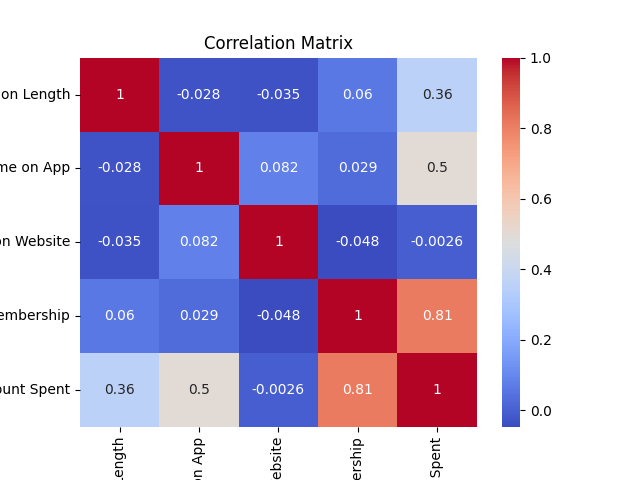

# Simple Linear Regression Model with EDA

This project builds a simple linear regression model using the provided dataset to predict the yearly amount spent by customers. The project involves several steps including data loading, exploratory data analysis (EDA), feature selection, and model building and evaluation.

## Dataset

The dataset is sourced from [Kaggle](https://www.kaggle.com/datasets/kolawale/focusing-on-mobile-app-or-website). It contains the following columns:
- `Email`: The user's email address.
- `Address`: The user's mailing address.
- `Avatar`: A color representing the user.
- `Avg. Session Length`: The average length of a user's sessions (in minutes).
- `Time on App`: The amount of time the user spends on the mobile app (in minutes).
- `Time on Website`: The amount of time the user spends on the website (in minutes).
- `Length of Membership`: The number of years the user has been a member.
- `Yearly Amount Spent`: The amount of money the user spends in a year.

## Prerequisites

Ensure you have the following Python libraries installed:
- pandas
- matplotlib
- seaborn
- scikit-learn

You can install these using pip:
```bash
pip install pandas numpy matplotlib seaborn scikit-learn
```
or
```bash
pip install -r requirements.txt
```
## Steps

### Step 1: Setup and Library Imports

Import necessary libraries for data handling, visualization, and model building.

### Step 2: Data Loading

Load the dataset into a pandas DataFrame.

```python
import pandas as pd

# Load the dataset
url = "path_to_your_downloaded_dataset.csv"
df = pd.read_csv(url)
```

### Step 3: Exploratory Data Analysis (EDA)

Perform EDA to understand the dataset:
- **Data Cleaning**: Check and handle missing values.
- **Visualization**: Plot distributions of features and check correlations.
- **Statistical Analysis**: Get summary statistics of the dataset.
**Example Plots:**
**Distribution of Average Session Length:**


**Distribution of Time on App:** 

**Distribution of Time on Website:** 

**Distribution of Length of Membership:**

```python
# Checking for missing values
df.isnull().sum()

# Summary statistics
df.describe()

# Visualization
import seaborn as sns
import matplotlib.pyplot as plt

sns.histplot(df['Avg. Session Length'])
plt.show()

sns.histplot(df['Time on App'])
plt.show()

sns.histplot(df['Time on Website'])
plt.show()

sns.histplot(df['Length of Membership'])
plt.show()

# Correlation
corr_matrix = df.corr()
sns.heatmap(corr_matrix, annot=True, cmap='coolwarm')
plt.show()
```

**Correlation Matrix:**

### Step 4: Feature Selection

Select features (`X`) and target variable (`y`) for the linear regression model.

```python
features = ['Avg. Session Length', 'Time on App', 'Time on Website', 'Length of Membership']
target = 'Yearly Amount Spent'

X = df[features]
y = df[target]
```

### Step 5: Model Building

Split the data into training and testing sets, then train a linear regression model.

```python
from sklearn.model_selection import train_test_split
from sklearn.linear_model import LinearRegression

# Splitting the data
X_train, X_test, y_train, y_test = train_test_split(X, y, test_size=0.2, random_state=42)

# Create and train the model
model = LinearRegression()
model.fit(X_train, y_train)
```

### Step 6: Model Evaluation

Evaluate the model using Mean Squared Error (MSE) and R-squared (R²) score.

```python
from sklearn.metrics import mean_squared_error, r2_score

# Predictions
y_pred = model.predict(X_test)

# Evaluation
mse = mean_squared_error(y_test, y_pred)
r2 = r2_score(y_test, y_pred)

print(f'Mean Squared Error: {mse}')
print(f'R^2 Score: {r2}')
```

### Step 7: Conclusion

Summarize your findings, key insights, and possible improvements or next steps.

## Conclusion

- **Key Insights**: Insights gained from the EDA and model.
- **Model Performance**: Metrics indicating how well the model performs.
- **Future Work**: Suggestions for further improvement or additional analysis.

## Acknowledgements

- Dataset sourced from [Kaggle](https://www.kaggle.com/datasets/kolawale/focusing-on-mobile-app-or-website).

---

Feel free to modify and expand this README file based on your specific findings and additional steps you take throughout the project.